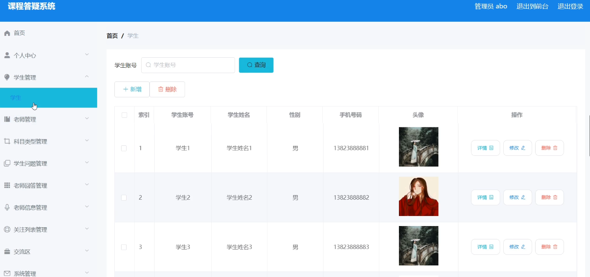

**项目简介：**  
本项目基于主流的前后端分离架构，采用 **SpringBoot + Vue 技术栈**，配套 **MySQL 数据库**，适用于毕业设计与课题实训开发。  
本人已整理了超 **4000 多套毕业设计源码+论文+开题报告+PPT...**，涵盖 **Java、SpringBoot、Vue、SSM、uni-app 小程序、PHP、Android** 等方向，支持功能修改定制与论文服务。  
**团队提供以下服务：**  
- 项目代码修改与调试  
- 数据库配置与远程协助  
- 论文定制与修改  
**获取更多的4000多套源码或SQL文件请联系：**  
- QQ：3906443360 微信：BesheHelp

# springboot059课程答疑系统

（1）学生问题信息的实体属性图如下：

图4.12  学生问题信息实体属性图

（2）老师信息实体属性图如图4.13所示：

图4.13  老师信息实体属性图

（3）科目类型信息实体属性图如图4.14所示：

图4.14 科目类型信息实体属性图

4.3.2数据库设计表

课程答疑系统需要后台数据库，下面介绍数据库中的各个表的详细信息：

表4.1 老师回答评论表

表4.2 老师信息评论表

表4.3 学生问题评论表

表4.4 交流区

表4.5 关注列表

表4.6 科目类型

表4.7 老师

表4.8 老师回答

表4.9 老师信息

表4.10 收藏表

表4.11 管理员表

表4.12 学生

表4.13 学生问题

5系统详细实现

5.1 管理员模块的实现

5.1.1 学生信息管理

课程答疑系统的系统管理员可以管理学生，可以对学生信息添加修改删除以及查询操作。具体界面的展示如图5.1所示。

图5.1 学生信息管理界面

5.1.2 科目类型管理

系统管理员可以查看对科目类型信息进行添加，修改，删除以及查询操作。具体界面如图5.2所示。

图5.2 科目类型信息管理界面

5.2 老师模块的实现

5.2.1 老师回答管理

老师可以对老师回答进行查看以及查询操作。界面如下图所示：

图5.3 在线报名信息管理界面

5.2.1 我的收藏管理

老师可以对报我的收藏信息进行添加修改删除操作，还可以对业务信息进行查询。界面如下图所示：

图5.4 我的收藏管理界面

5.2 学生模块的实现

5.2.2 学生问题

学生登录之后，可以查看学生问题信息，也可以发布学生问题信息。界面如下图所示：

图5.5 学生问题界面

5.2.3 留言反馈

学生登录后在首页查看老师回答信息。界面如下图所示：

图5.6 老师回答信息界面

5.2.3 交流区

学生登录后可以在交流区发布信息。界面如下图所示：

图5.7 交流区界面